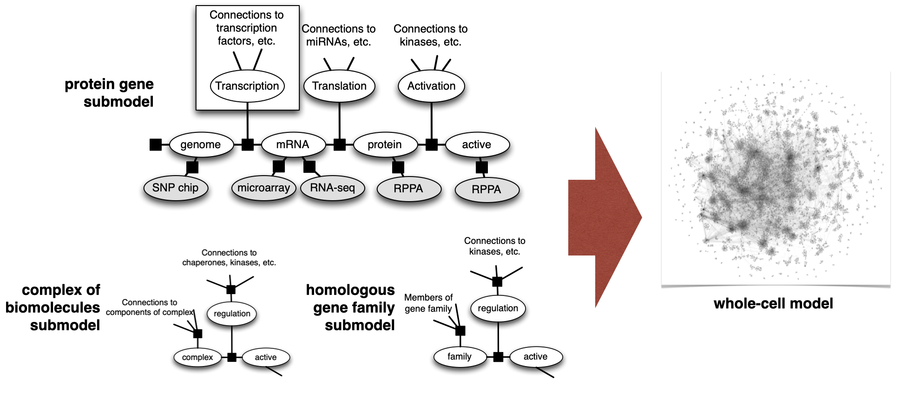
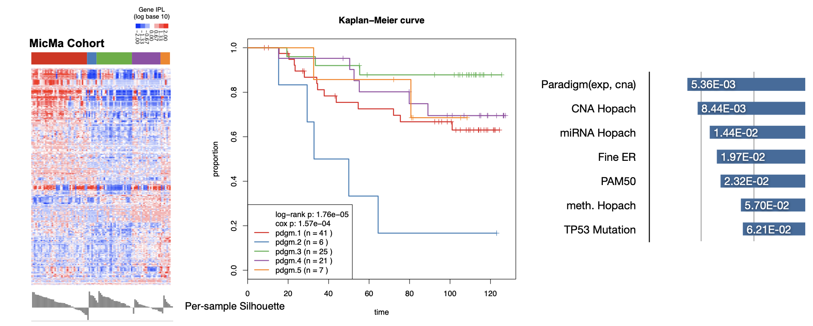

# Seavaske
personal page for Charles Vaske 

About me: I love to study biology through the lens of computation, mostly in the field of genomics. I'm passionate about translating discovery all the way to practice, such as developing and getting regulatory approval for comprehensive genomic/transcriptomic profiling of tumors.

### Favorite work

#### Paradigm

Genomics provides multi-modal views of biological sample, and cancer has some of the most extreme changes compared to normal body tissues. Paradigm is a method for integrating gene expression levels, DNA methylation, protein abundance measurements, and gene copy numbers all on top of know interactions between proteins and the genome. It's an attempt to combine all the available data with all the availble knowledge of regulation in a cell.

By modeling individual genes, complexes of molecules, and gene families, we construct a factor graph that models a whole cell:

These models make predictions about activity profiles in indivdiual tumors, which can be more informative than the source data types. For example in a Norwegian cohort of breast cancer micro-metastases, the subtyping was more informative for progression than the other data types:

